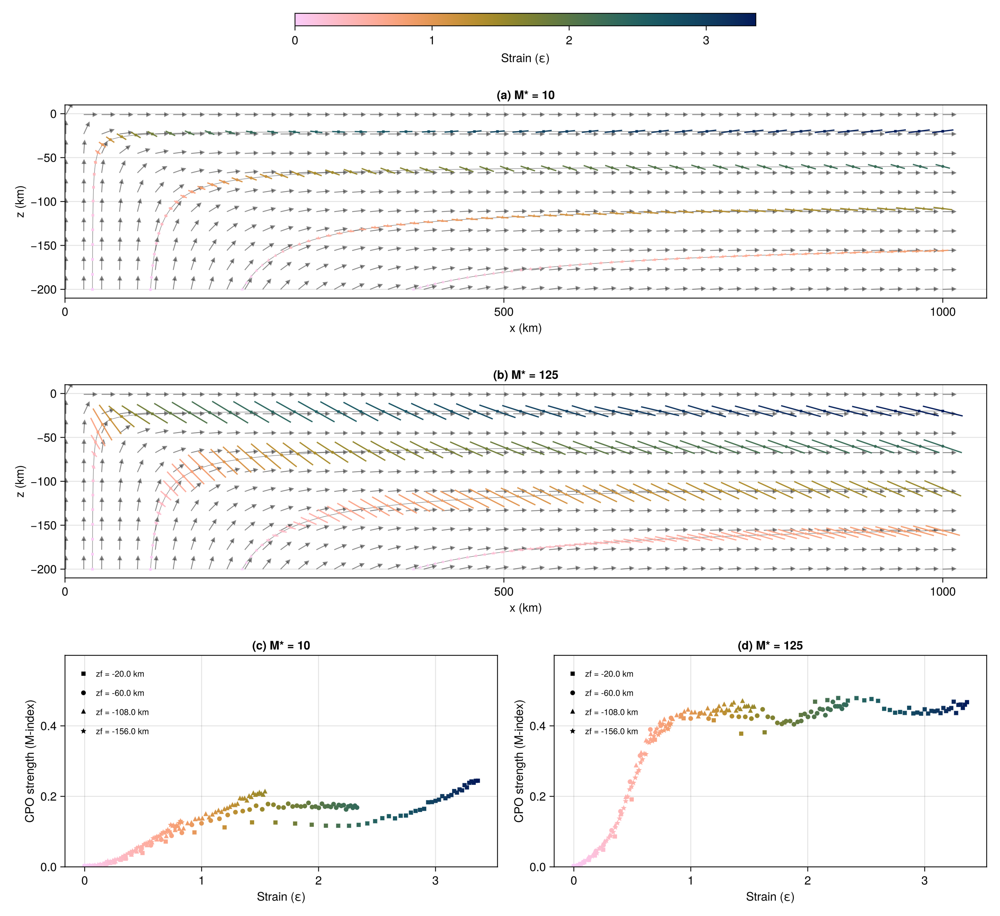

# DRex.jl

A Julia translation of the [PyDRex](https://github.com/seismic-anisotropy/PyDRex) package for simulating crystallographic preferred orientation (CPO) evolution in polycrystals (as described in [Bilton et al. (2025)](https://academic.oup.com/gji/article/241/1/35/7965963)), which is again based on the DRex package developed by Kaminsky & Ribe (2001,2004).
Since Julia is a compiled language this runs much faster than the python version (>3 orders of magnitude, if numbers mentioned in the python test suite are representative).

## Overview

DRex.jl implements the D-Rex model (Kaminski & Ribe, 2001; 2004) for computing the evolution of crystal orientations and grain size distributions during plastic deformation. The key routines are designed to be **allocation-free** using `StaticArrays.jl`, making the inner-loop grain-level computations highly efficient.

### Main Features

- **Core D-Rex solver** (`derivatives!`): computes crystallographic rotation rates and volume fraction changes for olivine and enstatite polycrystals
- **Mineral texture tracking** (`Mineral`, `update_orientations!`): ODE-based CPO integration along pathlines with grain boundary sliding and recrystallisation
- **Voigt averaging** (`voigt_averages`): elastic tensor averaging over polycrystal orientations
- **Texture diagnostics**: symmetry decomposition (`elasticity_components`), point-girdle-random analysis (`symmetry_pgr`), misorientation index (`misorientation_index`), and finite strain analysis (`finite_strain`)
- **Velocity fields**: analytical 2D velocity and velocity gradient functions for simple shear, convection cells, and corner flow
- **Tensor operations**: Voigt notation conversions, symmetry projections, and polar decomposition

## Installation

```julia
using Pkg
Pkg.develop(path="path/to/DRex.jl")
```

Or add as a dependency:

```julia
] add path/to/DRex.jl
```

### Dependencies

- `LinearAlgebra` (stdlib)
- `StaticArrays.jl` — for allocation-free inner-loop computations
- `OrdinaryDiffEq.jl` — ODE integration for CPO evolution
- `Rotations.jl` — rotation utilities
- `Random` (stdlib)

## Quick Start

```julia
using LinearAlgebra
using DRex

# Create an olivine mineral with default parameters
mineral = Mineral(
    phase = olivine,
    fabric = olivine_A,
    regime = matrix_dislocation,
    n_grains = 3500,
    seed = 8816,
)

# Set up simple shear velocity field
_, get_velocity_gradient = simple_shear_2d("X", "Z", 1e-15)

# Define simulation parameters and timesteps
params = default_params()
timestamps = range(0, 1, length=25)

# Integrate CPO along a pathline
deformation_gradient = Matrix{Float64}(I, 3, 3)
for t in 2:length(timestamps)
    global deformation_gradient = update_orientations!(
        mineral,
        params,
        deformation_gradient,
        get_velocity_gradient,
        (timestamps[t-1], timestamps[t], t -> zeros(3)),
    )
end

mineral  # shows texture summary
```

## Module Structure

| File | Description |
|---|---|
| `core.jl` | Enums, parameters, CRSS, allocation-free D-Rex solver |
| `minerals.jl` | `Mineral` type, `update_orientations!`, Voigt averaging |
| `tensors.jl` | Voigt notation, tensor rotations, symmetry projections |
| `geometry.jl` | Coordinate conversions, Lambert projections, poles |
| `diagnostics.jl` | Elasticity decomposition, PGR symmetry, M-index |
| `velocity.jl` | Simple shear, convection cell, corner flow fields |
| `stats.jl` | Orientation resampling, misorientation histograms |
| `utils.jl` | Strain increment, GBS, quaternion utilities |

## Allocation-Free Design

The inner-loop grain-level computations use `SMatrix` and `SVector` from `StaticArrays.jl`:

- `_get_slip_invariants` — strain rate invariants for 4 slip systems
- `_get_deformation_rate` — Schmid tensor computation
- `_get_slip_rate_softest` — softest slip system rate
- `_get_slip_rates_olivine` — relative slip rates
- `_get_orientation_change` — single-grain rotation rate
- `_get_strain_energy` — dislocation strain energy
- `_get_rotation_and_strain` — combined rotation + energy (top-level per-grain function)

All these functions are marked `@inline` and operate exclusively on static-sized types, ensuring zero heap allocations per grain per timestep.

## Supported Phases and Fabrics

- **Olivine**: fabrics A, B, C, D, E (different CRSS distributions for 4 slip systems)
- **Enstatite**: fabric AB (single active slip system)

## Key Types

- `MineralPhase`: `olivine`, `enstatite`
- `MineralFabric`: `olivine_A` through `olivine_E`, `enstatite_AB`
- `DeformationRegime`: `matrix_dislocation`, `frictional_yielding`, `matrix_diffusion`, etc.
- `DefaultParams`: default simulation parameters
- `Mineral`: mutable struct storing orientation/fraction history
- `StiffnessTensors`: olivine and enstatite elastic stiffness tensors (GPa)

## Running Tests

```julia
using Pkg
Pkg.activate("path/to/DRex.jl")
Pkg.test()
```

The test suite includes:
- Analytical single-grain rotation rate tests for OPX and olivine A-type
- Voigt tensor decomposition and conversion tests
- Elasticity symmetry decomposition tests (Browaeys & Chevrot, 2004)
- PGR symmetry diagnostic tests (point, girdle, random textures)
- Lambert equal-area projection round-trip tests
- Strain increment accumulation tests
- Full CPO integration tests (zero recrystallisation, decreasing grain size median)

## Citing 
We developed DRex.jl by translating the python package PyDRex, developed by Bilton et al (2025) to Julia, including all tests. If you find our package useful, please give credit to the original authors as well by citing their work:

- Bilton, L., Duvernay, T., Davies, D.R., Eakin, C.M., 2025. PyDRex: predicting crystallographic preferred orientation in peridotites under steady-state and time-dependent strain. *Geophysical Journal International* 241, 35–57. https://doi.org/10.1093/gji/ggaf026

As there are no new features compared to the python version, we do not plan a separate publication at this stage. You can cite the package from the Zenodo repository:


## References

- Kaminski, É. & Ribe, N.M. (2001). A kinematic model for recrystallization and texture development in olivine polycrystals. *Earth and Planetary Science Letters*, 189(3-4), 253-267.
- Kaminski, É. & Ribe, N.M. (2004). Timescales for the evolution of seismic anisotropy in mantle flow. *Geochemistry, Geophysics, Geosystems*, 3(1).
- Browaeys, J.T. & Chevrot, S. (2004). Decomposition of the elastic tensor and geophysical applications. *Geophysical Journal International*, 159(2), 667-678.
- Bilton, L., Duvernay, T., Davies, D.R., Eakin, C.M., 2025. PyDRex: predicting crystallographic preferred orientation in peridotites under steady-state and time-dependent strain. *Geophysical Journal International* 241, 35–57. https://doi.org/10.1093/gji/ggaf026

## Example: Corner Flow CPO

The script [`examples/standalone/cornerflow_simple.jl`](examples/standalone/cornerflow_simple.jl) reproduces Figure 10 of Bilton et al. (2025). It evolves olivine CPO along four pathlines in an analytical 2D corner flow, for two GBM mobility values (M\*=10 and M\*=125).

Panels (a) and (b) show Bingham-average olivine a-axis directions as bars scaled by the M-index (texture strength), with background arrows showing the velocity field. Panels (c) and (d) show M-index vs accumulated strain. Bar and marker colour encodes strain along the pathline.



Run it with:

```bash
cd examples/standalone
julia --project=. cornerflow_simple.jl
```
