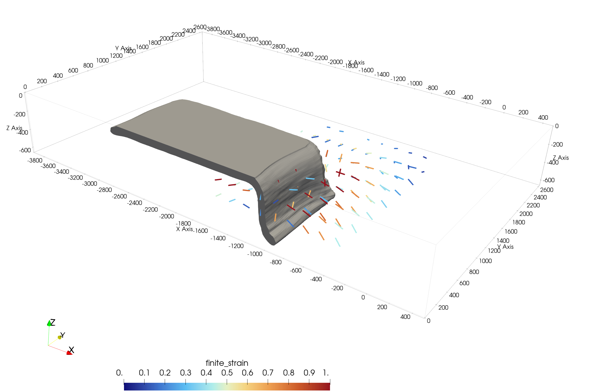

# DRex.jl

[](https://github.com/JuliaGeodynamics/DRex.jl/actions/workflows/CI.yml)
[](https://doi.org/10.5281/zenodo.19110048)

A Julia translation of the [PyDRex](https://github.com/seismic-anisotropy/PyDRex) package for simulating crystallographic preferred orientation (CPO) evolution in polycrystals (as described in [Bilton et al. (2025)](https://academic.oup.com/gji/article/241/1/35/7965963)), which is again based on the DRex package developed by Kaminsky & Ribe (2001,2004).
Since Julia is a compiled language this runs much faster than the python version (>3 orders of magnitude, if numbers mentioned in the python test suite are representative).

## Overview

DRex.jl implements the D-Rex model (Kaminski & Ribe, 2001; 2004) for computing the evolution of crystal orientations and grain size distributions during plastic deformation. The key routines are designed to be **allocation-free** using `StaticArrays.jl`, making the inner-loop grain-level computations highly efficient.

### Main Features

- **Core D-Rex solver** (`derivatives!`): computes crystallographic rotation rates and volume fraction changes for olivine and enstatite polycrystals
- **Mineral texture tracking** (`Mineral`, `update_orientations!`): ODE-based CPO integration along pathlines with grain boundary sliding and recrystallisation
- **Voigt averaging** (`voigt_averages`): elastic tensor averaging over polycrystal orientations
- **Texture diagnostics**: symmetry decomposition (`elasticity_components`), point-girdle-random analysis (`symmetry_pgr`), misorientation index (`misorientation_index`), and finite strain analysis (`finite_strain`)
- **Velocity fields**: analytical 2D velocity and velocity gradient functions for simple shear, convection cells, and corner flow
- **Tensor operations**: Voigt notation conversions, symmetry projections, and polar decomposition
- **LaMEM integration** (optional extension): couples DRex CPO tracking to 3D geodynamic simulations run with [LaMEM](https://github.com/JuliaGeodynamics/LaMEM.jl); auto-loads when `LaMEM` and `GeophysicalModelGenerator` are imported alongside DRex

## Installation

DRex.jl is hosted on GitHub at [JuliaGeodynamics/DRex.jl](https://github.com/JuliaGeodynamics/DRex.jl). Since it is not yet registered in the General registry, install it directly from the repository:

```julia
using Pkg
Pkg.add(url="https://github.com/JuliaGeodynamics/DRex.jl")
```

Or from the package REPL (press `]`):

```julia
] add https://github.com/JuliaGeodynamics/DRex.jl
```

For local development:

```julia
using Pkg
Pkg.develop(url="https://github.com/JuliaGeodynamics/DRex.jl")
```

### Dependencies

- `LinearAlgebra` (stdlib)
- `StaticArrays.jl` — for allocation-free inner-loop computations
- `OrdinaryDiffEq.jl` — ODE integration for CPO evolution
- `Rotations.jl` — rotation utilities
- `Random` (stdlib)

## Quick Start

```julia
using LinearAlgebra
using DRex

# Create an olivine mineral with default parameters
mineral = Mineral(
    phase = olivine,
    fabric = olivine_A,
    regime = matrix_dislocation,
    n_grains = 3500,
    seed = 8816,
)

# Set up simple shear velocity field
_, get_velocity_gradient = simple_shear_2d("X", "Z", 1e-15)

# Define simulation parameters and timesteps
params = default_params()
timestamps = range(0, 1, length=25)

# Integrate CPO along a pathline
deformation_gradient = Matrix{Float64}(I, 3, 3)
for t in 2:length(timestamps)
    global deformation_gradient = update_orientations!(
        mineral,
        params,
        deformation_gradient,
        get_velocity_gradient,
        (timestamps[t-1], timestamps[t], t -> zeros(3)),
    )
end

mineral  # shows texture summary
```

## Module Structure

| File | Description |
|---|---|
| `core.jl` | Enums, parameters, CRSS, allocation-free D-Rex solver |
| `minerals.jl` | `Mineral` type, `update_orientations!`, Voigt averaging |
| `tensors.jl` | Voigt notation, tensor rotations, symmetry projections |
| `geometry.jl` | Coordinate conversions, Lambert projections, poles |
| `diagnostics.jl` | Elasticity decomposition, PGR symmetry, M-index |
| `velocity.jl` | Simple shear, convection cell, corner flow fields |
| `stats.jl` | Orientation resampling, misorientation histograms |
| `utils.jl` | Strain increment, GBS, quaternion utilities |

## Allocation-Free Design

The inner-loop grain-level computations use `SMatrix` and `SVector` from `StaticArrays.jl`:

- `_get_slip_invariants` — strain rate invariants for 4 slip systems
- `_get_deformation_rate` — Schmid tensor computation
- `_get_slip_rate_softest` — softest slip system rate
- `_get_slip_rates_olivine` — relative slip rates
- `_get_orientation_change` — single-grain rotation rate
- `_get_strain_energy` — dislocation strain energy
- `_get_rotation_and_strain` — combined rotation + energy (top-level per-grain function)

All these functions are marked `@inline` and operate exclusively on static-sized types, ensuring zero heap allocations per grain per timestep.

## Supported Phases and Fabrics

- **Olivine**: fabrics A, B, C, D, E (different CRSS distributions for 4 slip systems)
- **Enstatite**: fabric AB (single active slip system)

## Key Types

- `MineralPhase`: `olivine`, `enstatite`
- `MineralFabric`: `olivine_A` through `olivine_E`, `enstatite_AB`
- `DeformationRegime`: `matrix_dislocation`, `frictional_yielding`, `matrix_diffusion`, etc.
- `DefaultParams`: default simulation parameters
- `Mineral`: mutable struct storing orientation/fraction history
- `StiffnessTensors`: olivine and enstatite elastic stiffness tensors (GPa)

## Running Tests

```julia
using Pkg
Pkg.test("DRex")
```

The test suite includes:
- Analytical single-grain rotation rate tests for OPX and olivine A-type
- Voigt tensor decomposition and conversion tests
- Elasticity symmetry decomposition tests (Browaeys & Chevrot, 2004)
- PGR symmetry diagnostic tests (point, girdle, random textures)
- Lambert equal-area projection round-trip tests
- Strain increment accumulation tests
- Full CPO integration tests (zero recrystallisation, decreasing grain size median)

## Citing 
We developed DRex.jl by translating the python package PyDRex, developed by Bilton et al (2025) to Julia, including all tests. If you find our package useful, please give credit to the original authors as well by citing their work:

- Bilton, L., Duvernay, T., Davies, D.R., Eakin, C.M., 2025. PyDRex: predicting crystallographic preferred orientation in peridotites under steady-state and time-dependent strain. *Geophysical Journal International* 241, 35–57. https://doi.org/10.1093/gji/ggaf026

As there are no new features compared to the python version, we do not plan a separate publication at this stage. You can cite the package from the Zenodo repository:

- Kaus, B.J.P., 2025. DRex.jl: A Julia package for simulating crystallographic preferred orientation (CPO) evolution (v0.1.0). Zenodo. https://doi.org/10.5281/zenodo.19110048

## References

- Kaminski, É. & Ribe, N.M. (2001). A kinematic model for recrystallization and texture development in olivine polycrystals. *Earth and Planetary Science Letters*, 189(3-4), 253-267.
- Kaminski, É. & Ribe, N.M. (2004). Timescales for the evolution of seismic anisotropy in mantle flow. *Geochemistry, Geophysics, Geosystems*, 3(1).
- Browaeys, J.T. & Chevrot, S. (2004). Decomposition of the elastic tensor and geophysical applications. *Geophysical Journal International*, 159(2), 667-678.
- Bilton, L., Duvernay, T., Davies, D.R., Eakin, C.M., 2025. PyDRex: predicting crystallographic preferred orientation in peridotites under steady-state and time-dependent strain. *Geophysical Journal International* 241, 35–57. https://doi.org/10.1093/gji/ggaf026

## LaMEM Integration

DRex.jl can be coupled to 3D geodynamic simulations run with [LaMEM](https://github.com/JuliaGeodynamics/LaMEM.jl) via an **optional package extension** that auto-loads when the trigger packages are present.

### Activating the extension

```julia
using LaMEM, GeophysicalModelGenerator, WriteVTK  # trigger packages
using DRex                                          # DRexLaMEMExt loads automatically
```

No extra installation steps are required beyond having those packages in your environment. Once loaded, the full LaMEM coupling API is available.

### How it works

1. **Load snapshots** — reads all LaMEM output timesteps (velocity gradient tensor and optionally velocity) and converts units to km / Myr / (1/Myr).
2. **Backtrack target positions** — starting from user-specified locations at the *final* timestep, positions are advected backward through the snapshot sequence using backward Euler integration. This finds where the material originated at the first used timestep.
3. **Seed CPO tracers** — `Mineral` tracers with random initial orientations are placed at the backtracked (source) positions.
4. **Evolve CPO forward** — tracers are advected forward through the snapshot sequence. At each step the velocity gradient is trilinearly interpolated from the snapshot grid and the DRex ODE is integrated. Grain boundary migration, recrystallisation, and GBS are applied. All tracers evolve in parallel using `Threads.@threads`.
5. **Write Paraview output** — a `.pvd` time-series plus per-step `.vtp` polydata files are written, containing tracer positions and point data: `fast_axis` (Bingham-mean olivine a-axis), `m_index` (texture strength 0–1), and `finite_strain`.

The result is that tracers end up at (approximately) the target positions at the final timestep, carrying the CPO that material at those locations would have accumulated along its flow path.

### Key types

| Type | Description |
|---|---|
| `LaMEMSnapshot` | One LaMEM timestep: `time`, `x/y/z` grid (km), `vel_grad` (1/Myr), `velocity` (km/Myr) |
| `CPOTracer` | Lagrangian particle: `position`, `positions` history, `minerals`, `deformation_gradient` |

### Main API

Exactly one of `target_positions` or `initial_positions` must be provided:

| Keyword | Description |
|---|---|
| `target_positions` | `[x,y,z]` km where CPO is desired at the **last snapshot**; positions are backtracked to find the material source |
| `initial_positions` | `[x,y,z]` km of material at the **first snapshot**; CPO is evolved forward directly without backtracking |

```julia
# Time-dependent mode — full snapshot sequence (default)
tracers, snaps = compute_cpo_from_lamem(
    sim_name, sim_dir;
    target_positions   = [...],   # OR: initial_positions = [...]
    output_dir         = "$(sim_name)_tracers",
    skip_initial_steps = 5,
    start_step         = nothing,   # optional sub-window start
    end_step           = nothing,   # optional sub-window end
    drex_params        = default_params(),
    n_grains           = 1000,
    seed               = 42,
    n_substeps         = 5,
    fabric             = olivine_A,
)

# Steady-state mode — single snapshot, constant velocity field
tracers, snaps = compute_cpo_from_lamem(
    sim_name, sim_dir;
    target_positions      = [...],   # OR: initial_positions = [...]
    steady_state_step     = 100,     # index into the usable snapshot window
    steady_state_duration = 20.0,    # total integration time (Myr)
    steady_state_n_steps  = 200,     # number of output steps
    drex_params           = default_params(),
)
```

Lower-level functions are also exported for custom workflows:

```julia
snaps   = load_snapshots(sim_name, sim_dir)
tracers = create_tracers(positions; n_grains=1000, seed=42, fabric=olivine_A)
src     = backtrack_positions(target_positions, snaps; n_substeps=5)
evolve_cpo!(tracers, params, snaps; advect=true, n_substeps=5)
```

---

## Example: Corner Flow CPO

The script [`examples/standalone/cornerflow_simple.jl`](examples/standalone/cornerflow_simple.jl) reproduces Figure 10 of Bilton et al. (2025). It evolves olivine CPO along four pathlines in an analytical 2D corner flow, for two GBM mobility values (M\*=10 and M\*=125).

Panels (a) and (b) show Bingham-average olivine a-axis directions as bars scaled by the M-index (texture strength), with background arrows showing the velocity field. Panels (c) and (d) show M-index vs accumulated strain. Bar and marker colour encodes strain along the pathline.


Run it with:

```bash
cd examples/standalone
julia --project=. cornerflow_simple.jl
```

## Example: LaMEM 3D Subduction with CPO

The [`examples/LaMEM/`](examples/LaMEM/) directory shows how to compute seismic anisotropy from a full 3D LaMEM subduction simulation.

### Prerequisites

The example assumes a LaMEM simulation has already been run with the following output flags in the `.dat` file:

```
out_vel_gr_tensor = 1   # velocity gradient tensor (required)
out_velocity      = 1   # velocity vector (required for backtracking)
```

Use the provided setup script to run the simulation:

```bash
cd examples/LaMEM
julia --project=. run_lamem_subduction3d.jl
```

This creates the output directory `Subduction_3D_CPO/` with all timestep files (`.pvts`, `.pvd`).

### Running CPO post-processing

```bash
cd examples/LaMEM
julia --project=. -t auto postprocess_cpo.jl
```

The `-t auto` flag activates all available CPU cores — one thread per tracer, so runtime scales linearly with the number of cores.

### What `postprocess_cpo.jl` does

The script is intentionally minimal. The user sets three things:

1. **`SIM_NAME` / `SIM_DIR`** — the LaMEM output file name and directory.
2. **`target_positions`** (or `initial_positions`) — where CPO is computed.
3. **`drex_params`** — DRex material parameters (phase fractions, `gbm_mobility`, etc.).

Then a single call to `compute_cpo_from_lamem` does everything:

```julia
tracers, snaps = compute_cpo_from_lamem(
    SIM_NAME, SIM_DIR;
    target_positions   = target_positions,
    output_dir         = "Subduction_3D_CPO_tracers",
    skip_initial_steps = 5,
    drex_params        = drex_params,
    n_grains           = 1000,
    n_substeps         = 5,
    fabric             = olivine_A,
)
```

Internally this:

1. Reads all LaMEM snapshots after snapshot 5 (skipping spin-up)
2. **Backtracks** the target positions to the first used snapshot — each position is advected backward through the velocity field, tracing where the material came from
3. Seeds CPO tracers with random orientations at the backtracked source positions
4. **Evolves CPO forward** from snapshot 5 to the final snapshot, interpolating velocity gradients trilinearly from the LaMEM grid at each substep
5. Writes a Paraview time-series to `Subduction_3D_CPO_tracers/cpo_tracers.pvd`

After the call, the script plots olivine [100] pole figures for each tracer at its final position.

### Specifying positions

Two options — provide exactly one:

| Keyword | Meaning |
|---|---|
| `target_positions` | Where you want CPO **at the end** of the run. Positions are backtracked through the velocity field to find where that material originated, then CPO is evolved forward. |
| `initial_positions` | Where material is **at the start** of the used window. CPO is evolved forward directly — no backtracking. Useful when you already know the source locations (e.g. from tracer output). |

Positions should be placed **within the deforming region** (e.g. inside the mantle wedge or slab). Points outside the mesh or in very low-strain regions produce near-random CPO (M-index ≈ 0).

### Time windowing (time-dependent mode)

To restrict CPO integration to a sub-interval of the simulation:

```julia
tracers, snaps = compute_cpo_from_lamem(
    SIM_NAME, SIM_DIR;
    target_positions   = target_positions,
    skip_initial_steps = 5,
    start_step = 50,   # use snapshots 50 … 150 only
    end_step   = 150,
)
```

### Steady-state mode

If you want to assume a fixed, time-invariant velocity field (e.g. to test CPO development in a snapshot of interest, or to avoid loading hundreds of timesteps), use steady-state mode:

```julia
tracers, snaps = compute_cpo_from_lamem(
    SIM_NAME, SIM_DIR;
    target_positions      = target_positions,
    steady_state_step     = 150,   # snapshot index within the usable window
    steady_state_duration = 20.0,  # integrate for 20 Myr
    steady_state_n_steps  = 200,   # number of output steps
    drex_params           = drex_params,
)
```

The velocity gradient and velocity from snapshot `steady_state_step` are held constant throughout. Backtracking (if `target_positions` is used) is done under the same constant velocity field.

### DRex material parameters

Key parameters to tune:

| Parameter | Meaning | Typical range |
|---|---|---|
| `gbm_mobility` | Grain boundary migration mobility M\* | 10–125 (lower = stronger CPO) |
| `phase_fractions` | Vol. fraction of each phase | `[0.7, 0.3]` for ol+opx |
| `gbs_threshold` | GBS activation threshold | 0.2–0.4 |

A `gbm_mobility` of 125 (default) produces relatively weak CPO because grain boundary migration efficiently randomizes orientations. For stronger CPO (more realistic for high-strain mantle flow), use 10–25.

### Visualising in Paraview

Open the output in Paraview:

```
File → Open → Subduction_3D_CPO_tracers/cpo_tracers.pvd
```

Useful Paraview filters and colormaps:

- **Glyph → Arrow**, oriented by the `fast_axis` vector field, scaled by `m_index` — shows the seismic fast axis direction and strength
- **Threshold** on `m_index` — hide tracers with near-random texture (M < 0.05)
- **Warp By Vector** or **Animate** — the tracer positions update with each timestep, showing the Lagrangian flow path of each material parcel

### Directory structure

```
examples/LaMEM/
├── Project.toml                  # environment with DRex, LaMEM, GMG, WriteVTK
├── run_lamem_subduction3d.jl     # run the LaMEM simulation
├── postprocess_cpo.jl            # CPO post-processing (the main user script)
├── Subduction_3D_CPO/            # LaMEM output (created by run script)
└── Subduction_3D_CPO_tracers/    # Paraview output (created by postprocess script)
    ├── cpo_tracers.pvd
    ├── cpo_tracers_0001.vtp
    ├── ...
    └── cpo_polefigures.png
```

### Result

The result gives a time-dependent picture of the developing CPO:
