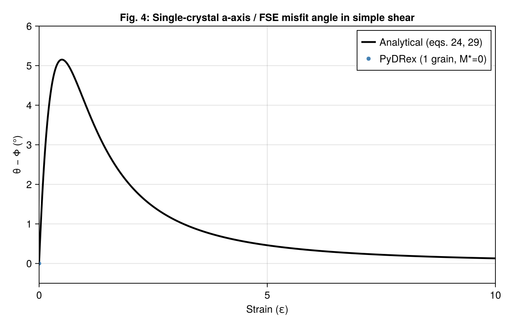
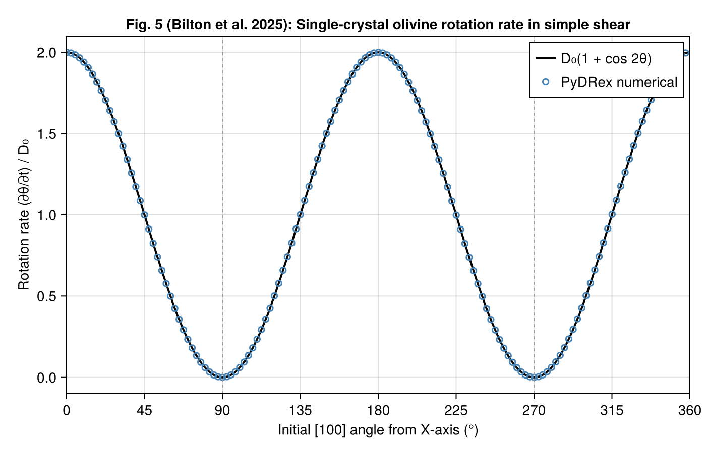
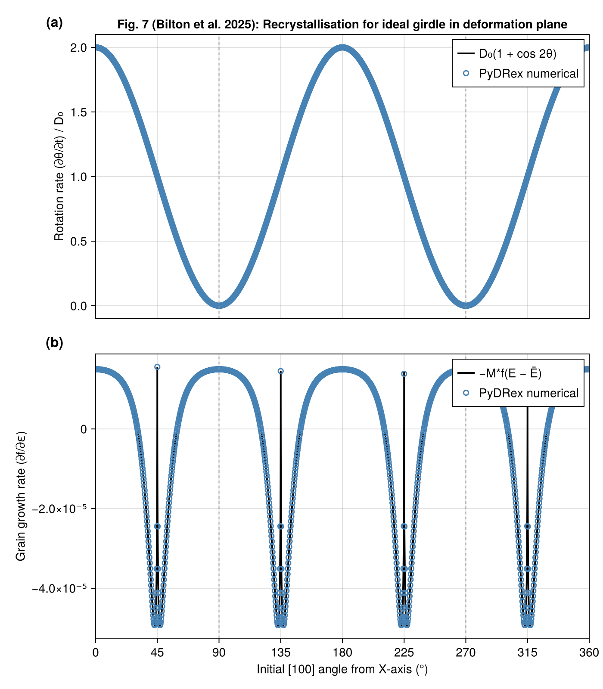
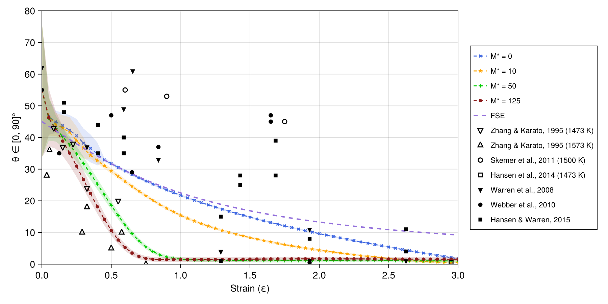
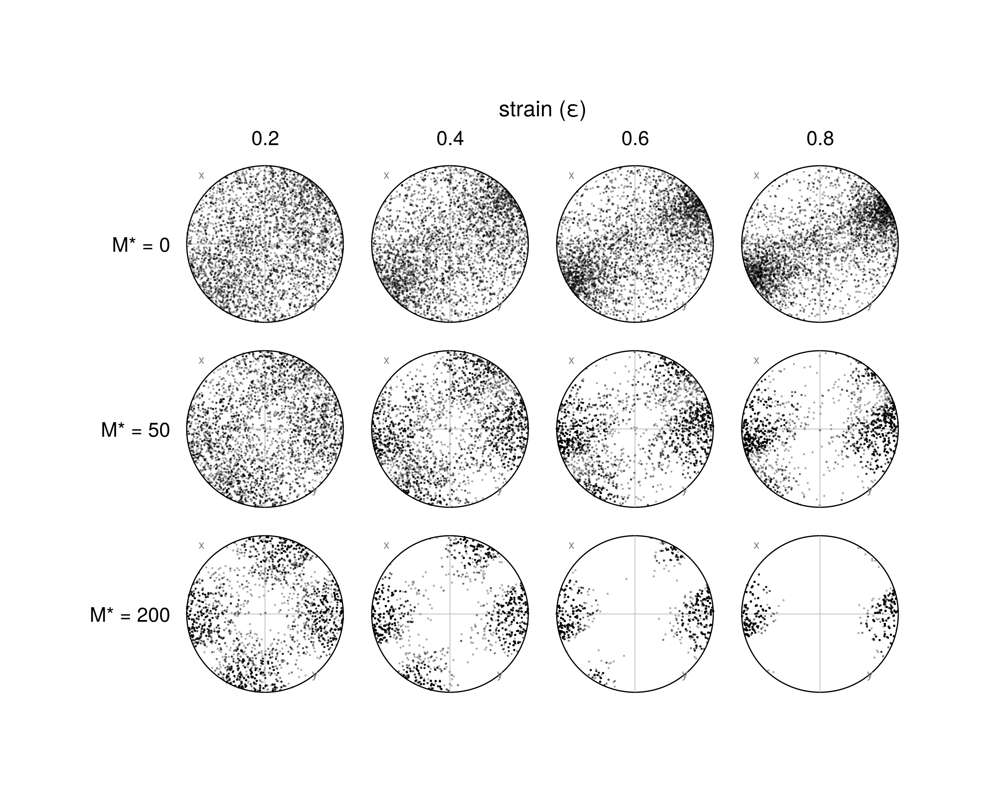
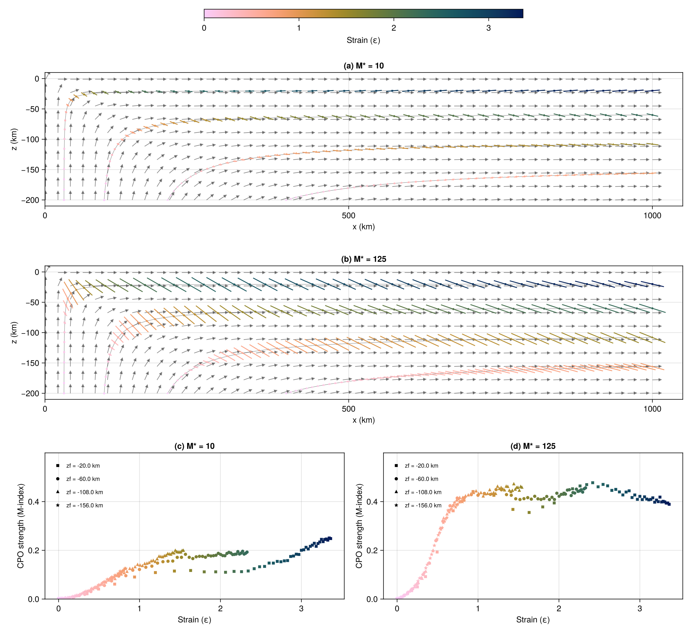

# Examples

All example scripts live in [`examples/standalone/`](https://github.com/JuliaGeodynamics/DRex.jl/tree/main/examples/standalone) and reproduce figures from Bilton et al. (2025). They require `CairoMakie` for plotting, which is available through the bundled project environment:

```bash
cd examples/standalone
julia --project=. -t auto <script>.jl
```

The `-t auto` flag activates all available CPU cores.

---

## Figure 4 — Single-crystal a-axis / FSE misfit (`fig4_simple_shear_lag.jl`)

Theoretical and numerical misfit between the olivine [100] a-axis angle θ and the finite strain ellipsoid (FSE) long-axis angle Φ in simple shear, as a function of accumulated strain ε.

Demonstrates:
- Analytical predictions (eqs. 24 and 29 of the paper) vs. DRex with 1 grain and M\*=0
- Use of [`finite_strain`](@ref) and [`smallest_angle`](@ref)



---

## Figure 5 — Single-crystal rotation rates (`fig5_rotation_rates.jl`)

Numerical rotation rates for a single A-type olivine crystal in simple shear, as a function of the initial [100] angle from the shear direction. Compared to the theoretical relationship (eq. 23 of the paper).

Demonstrates:
- Single-grain simulations with fixed initial orientation



---

## Figure 7 — Polycrystal rotation and growth rates (`fig7_recrystallisation.jl`)

Rotation rates (a) and grain growth rates (b) for an A-type olivine polycrystal with an ideal girdle texture in the X–Y plane, deforming in simple shear.

Demonstrates:
- Use of [`derivatives!`](@ref) directly on a polycrystal



---

## Figure 8 — Effect of M\* on CPO direction in simple shear (`fig8_simple_shear_GBM.jl`)

CPO direction (from the hexagonal symmetry axis of the Voigt-averaged elastic tensor) vs. accumulated strain, for several values of the grain boundary mobility M\*. Ensemble of multiple random seeds; mean ± 1 std. dev. plotted.

Demonstrates:
- Effect of `gbm_mobility` on CPO evolution
- [`voigt_averages`](@ref) and [`elasticity_components`](@ref)



---

## Figure 9 — [100] pole figures (`fig9_pole_figures.jl`)

[100] pole figures (Lambert equal-area projections) for A-type olivine in simple shear at four strain values and three M\* values (0, 50, 200).

Demonstrates:
- [`poles`](@ref) and [`lambert_equal_area`](@ref)
- [`resample_orientations`](@ref)



---

## Figure 10 — Corner flow CPO (`cornerflow_simple.jl`)

CPO evolution along four pathlines in an analytical 2D corner flow, for M\*=10 and M\*=125 (Fig. 10 of the paper). Panels show Bingham-average fast axis directions (scaled by M-index) and M-index vs. strain curves.

Reproduces the main benchmark figure used to validate the Julia implementation.

```bash
julia --project=. -t auto cornerflow_simple.jl          # CPU, Float64 + Float32
julia --project=. cornerflow_simple.jl --metal           # Metal GPU (Apple Silicon)
julia --project=. -t auto cornerflow_simple.jl --batch   # CPU batch integrator
```



---

## LaMEM 3D subduction (`examples/LaMEM/`)

Post-processes CPO from a full 3D LaMEM subduction simulation. See [LaMEM Integration](@ref) for details.
